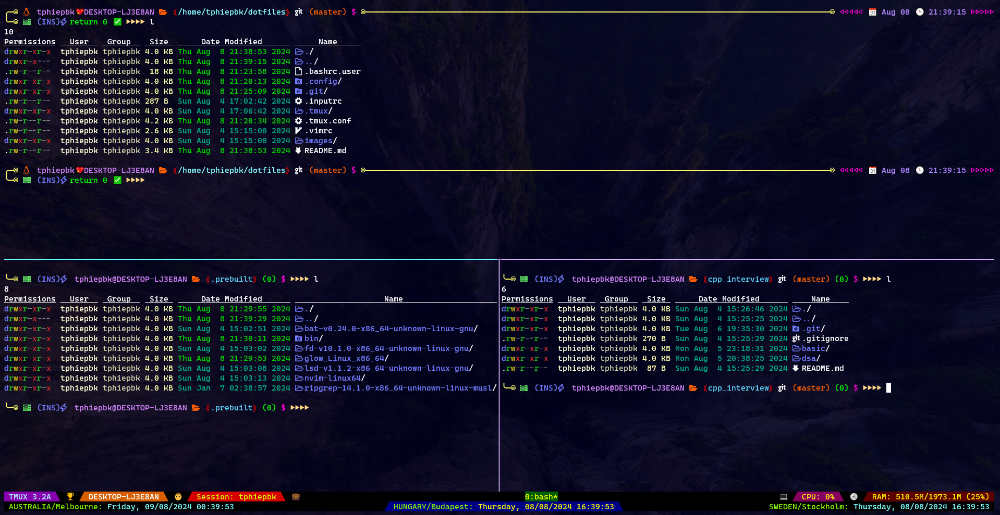
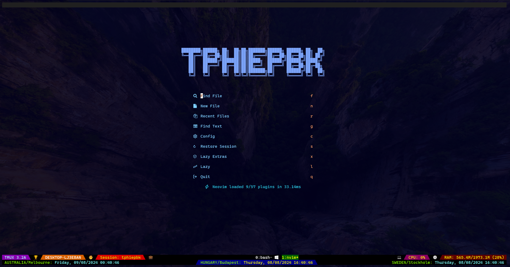
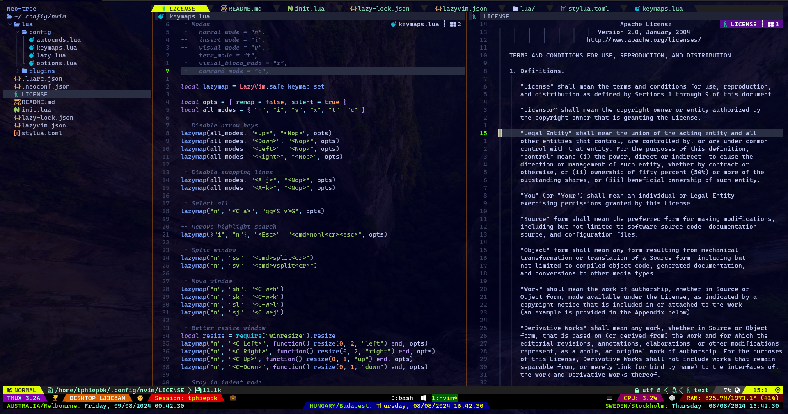
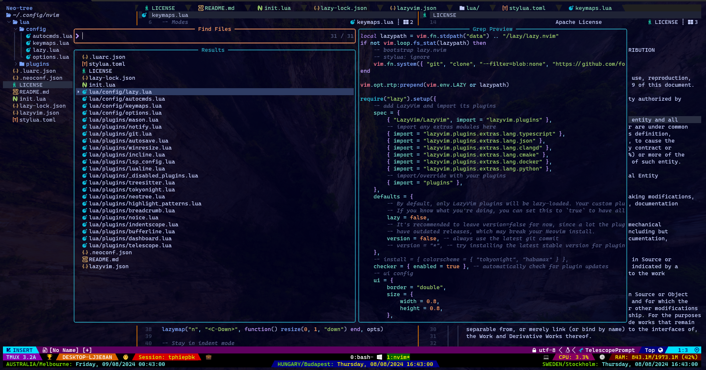

# TPHIEPBK'S CONFIGURATION

## OS

+ Windows Subsystem for Linux (WSL)
+ Distro: Ubuntu 22.04.3 LTS
+ RAM: 2GB
+ WSL configuration file on Windows: `C:\Users\thanh\.wslconfig`
```
[wsl2]
memory=2GB
```

+ WSL configuration file on the distro (Ubuntu): `/etc/wsl.conf`
```
[boot]
systemd=true

[interop]
appendWindowsPath=false
```

## Prerequisites

***apt packages***

`sudo apt-get install python3.10-venv python3-pip ruby-full bc`

***pip packages***

`pip install neovim`

***nodejs***
+ https://nodejs.org/en/download/package-manager
+ Use "nvm" to install

***npm packages***

`npm install -g neovim@latest tree-sitter-cli@latest`

***rust***
+ https://www.rust-lang.org/tools/install

***gem packages***

`gem install neovim`

***docker***
+ https://docs.docker.com/engine/install/ubuntu/#install-using-the-repository
+ Add current user to *docker* group: `sudo usermod -a -G docker tphiepbk`

## External opensource utilities

+ ***lsd***: The next gen ls command - https://github.com/lsd-rs/lsd
+ ***bat***: A cat(1) clone with wings - https://github.com/sharkdp/bat
+ ***fzf***: A command-line fuzzy finder - https://github.com/junegunn/fzf
+ ***ripgrep***: ripgrep recursively searches directories for a regex pattern while respecting your gitignore - https://github.com/BurntSushi/ripgrep
+ ***fd***: A simple, fast and user-friendly alternative to 'find' - https://github.com/sharkdp/fd
+ ***glow***: Render markdown on the CLI, with pizzazz! - https://github.com/charmbracelet/glow

## Neovim (version 0.10.1)

https://github.com/neovim/neovim

Use the "nvim-linux64.tar.gz" under "Releases" section

Use ***lazyvim*** - http://www.lazyvim.org/ for all configurations.

***Directory*** structure

/home/tphiepbk/.config/nvim</br>
├── lazyvim.json</br>
├── README.md</br>
├── .neoconf.json</br>
├── lua</br>
│   ├── plugins</br>
│   │   ├── telescope.lua</br>
│   │   ├── dashboard.lua</br>
│   │   ├── bufferline.lua</br>
│   │   ├── indentscope.lua</br>
│   │   ├── noice.lua</br>
│   │   ├── breadcrumb.lua</br>
│   │   ├── highlight_patterns.lua</br>
│   │   ├── neotree.lua</br>
│   │   ├── tokyonight.lua</br>
│   │   ├── treesitter.lua</br>
│   │   ├── _disabled_plugins.lua</br>
│   │   ├── lualine.lua</br>
│   │   ├── lsp_config.lua</br>
│   │   ├── incline.lua</br>
│   │   ├── winresize.lua</br>
│   │   ├── autosave.lua</br>
│   │   ├── git.lua</br>
│   │   ├── notify.lua</br>
│   │   └── mason.lua</br>
│   └── config</br>
│       ├── options.lua</br>
│       ├── keymaps.lua</br>
│       ├── autocmds.lua</br>
│       └── lazy.lua</br>
├── init.lua</br>
├── lazy-lock.json</br>
├── LICENSE</br>
├── stylua.toml</br>
└── .luarc.json</br>

## Keymaps

Leader key: `<Space>`

| Key 1     | Key 2   | Key 3 | Action                    |
|:---------:|:-------:|:----:|:--------------------------:|
| `<Space>`   | `<Space>` |      | Telescope find files       |
| `<Space>`   | `f`       |  `f`   | Telescope find files       |
| `<Space>`   | `f`       |  `g`   | Telescope live grep        |
| `<Space>`   | `f`       |  `b`   | Telescope find buffers     |
| `Tab`       |         |      | Next tab                   |
| `Shift`     | `Tab`     |      | Previous tab               |
| `s`         | `s`       |      | Split windows horizontally |
| `s`         | `v`       |      | Split windows vertically   |
| `<Space>`   | `e`       |      | Toggle NeoTree             |
| `<Space>`   | `q`       | `q`    | Quit                       |
| `<Space>`   | `q`       | `a`    | Quit all                   |
| `<Space>`   | `w`       | `q`    | Save and quit              |

## Screenshots

Visit http://patorjk.com/software/taag to get cool string like this.









## Inspired by: https://github.com/craftzdog/dotfiles-public
## Many thanks to all developers, appreciate it :D
