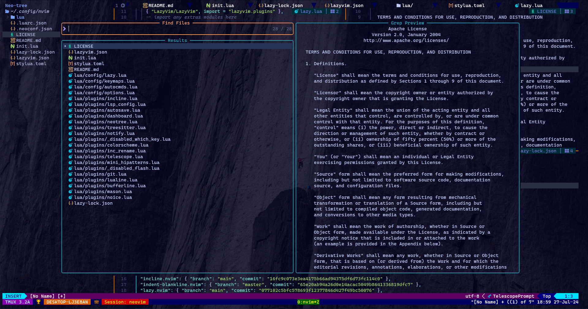

# TPHIEPBK'S CONFIGURATION

## Needed apt packages
+ python3.10-venv
+ rustc
+ ruby-full

## Needed npm packages

/home/tphiepbk/.prebuilt/nodejs/lib 
├── corepack@0.23.0 
├── express@4.18.3 
├── list@2.0.19 
├── neovim@5.0.1 
├── npm@10.5.0 
└── tree-sitter-cli@0.22. 

## External opensource utilities

+ ***lsd***: The next gen ls command - https://github.com/lsd-rs/lsd
+ ***bat***: A cat(1) clone with wings - https://github.com/sharkdp/bat
+ ***fzf***: A command-line fuzzy finder - https://github.com/junegunn/fzf
+ ***ripgrep***: ripgrep recursively searches directories for a regex pattern while respecting your gitignore - https://github.com/BurntSushi/ripgrep
+ ***fd***: A simple, fast and user-friendly alternative to 'find' - https://github.com/sharkdp/fd
+ ***glow***: Render markdown on the CLI, with pizzazz! - https://github.com/charmbracelet/glow

## Neovim (version 0.9.5)

Use ***lazyvim*** - http://www.lazyvim.org/ for all configurations.

***Directory*** structure

/home/tphiepbk/.config/nvim 
├── lazy-lock.json 
├── lua 
│   ├── plugins 
│   │   ├── noice.lua 
│   │   ├── mason.lua 
│   │   ├── bufferline.lua 
│   │   ├── lualine.lua 
│   │   ├── git.lua 
│   │   ├── _disabled_flash.lua 
│   │   ├── mini_hipatterns.lua 
│   │   ├── telescope.lua 
│   │   ├── inc_rename.lua 
│   │   ├── colorscheme.lua 
│   │   ├── _disabled_which_key.lua 
│   │   ├── notify.lua 
│   │   ├── treesitter.lua 
│   │   ├── neotree.lua 
│   │   ├── dashboard.lua 
│   │   ├── autosave.lua 
│   │   ├── lsp_config.lua 
│   │   └── incline.lua 
│   └── config 
│       ├── options.lua 
│       ├── autocmds.lua 
│       ├── keymaps.lua 
│       └── lazy.lua 
├── README.md 
├── stylua.toml 
├── init.lua 
├── lazyvim.json 
└── LICENSE 

## Keymaps

Leader key: `<Space>`

| Leader | Key 1      | Key 2  | Action                     |
|:------:|:----------:|:------:|:--------------------------:|
| Yes    | `<Space>`  |        | Telescope find files       |
| Yes    | `/`        |        | Telescope live grep        |
| No     | `Alt`      | `jk`   | Move line(s)               |
| No     | `Tab`      |        | Next tab                   |
| No     | `Shift`    | `Tab`  | Previous tab               |
| No     | `s`        | `s`    | Split windows horizontally |
| No     | `s`        | `v`    | Split windows vertically   |
| Yes    | `q`        | `q`    | Quit                       |
| Yes    | `q`        | `a`    | Quit all                   |
| Yes    | `w`        | `q`    | Save and quit              |
| Yes    | `r`        | `n`    | Incremental Rename         |

## Screenshots

Visit http://patorjk.com/software/taag to get cool string like this.

## Inspired by: https://github.com/craftzdog/dotfiles-public
## Many thanks to all developers, appreciate it :D
