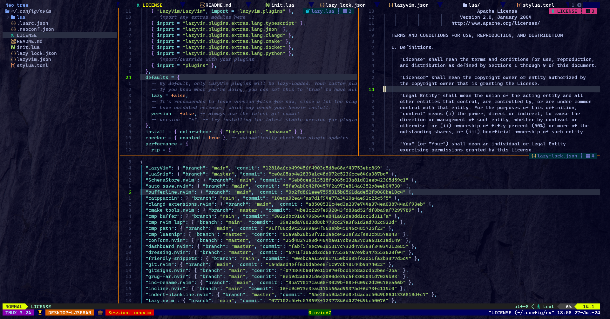

## TPHIEPBK'S CONFIGURATION

### Needed apt packages
+ python3.10-venv
+ rustc
+ ruby-full

### Needed npm packages

/home/tphiepbk/.prebuilt/nodejs/lib 
├── corepack@0.23.0 
├── express@4.18.3 
├── list@2.0.19 
├── neovim@5.0.1 
├── npm@10.5.0 
└── tree-sitter-cli@0.22. 

### External opensource utilities

+ ***lsd***: The next gen ls command - https://github.com/lsd-rs/lsd
+ ***bat***: A cat(1) clone with wings - https://github.com/sharkdp/bat
+ ***fzf***: A command-line fuzzy finder - https://github.com/junegunn/fzf
+ ***ripgrep***: ripgrep recursively searches directories for a regex pattern while respecting your gitignore - https://github.com/BurntSushi/ripgrep
+ ***fd***: A simple, fast and user-friendly alternative to 'find' - https://github.com/sharkdp/fd

### Neovim (version 0.9.5)

Use ***lazyvim*** - http://www.lazyvim.org/ for all configurations

### Some images

### Inspired by: https://github.com/craftzdog/dotfiles-public
### Many thanks to all developers, appreciate it :D
